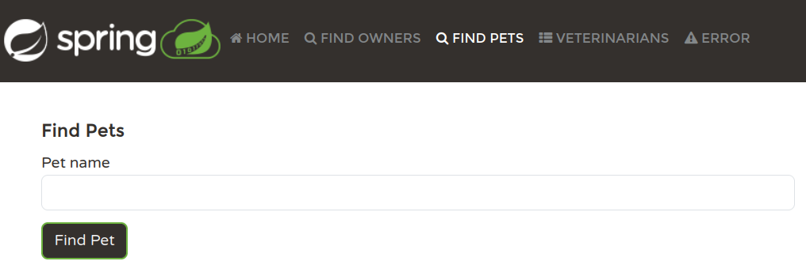
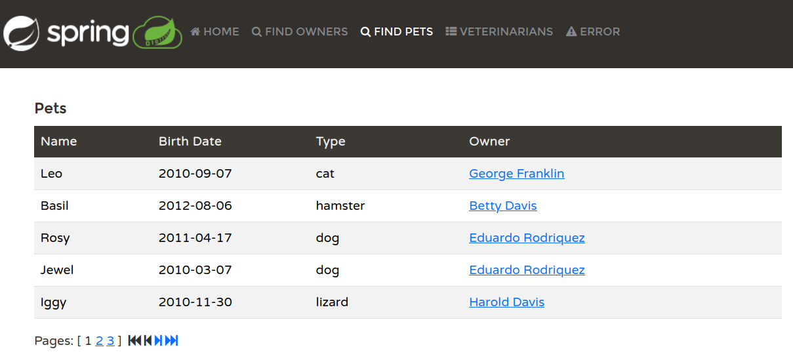
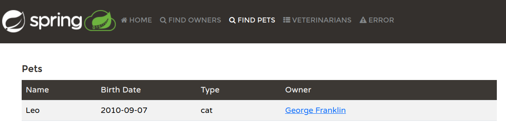

# Generate Feature

Can AI generate a new feature? 

In the [Spring Petclinic](https://github.com/spring-projects/spring-petclinic) you can search for the owners.

The starting point is this [main branch](https://github.com/mydeveloperplanet/devoxxgenie-spring-petclinic/tree/feature/search-pets-local-llm-gpu-main)

Run it as follows:
```shell
mvn spring-boot:run
```


Search for 'Franklin'


Now you would like to have similar functionality for finding pets.

## Setup
LMStudio, qwen2.5-coder, GPU. With this setup, it was not possible to add the entire source directory to the prompt due to the hardware limit.
Instead, this task is executed by means of Anthropic using model Claude 3.5 Sonnet.

## Prompt
Add the project to the prompt context and enter the prompt.
```text
create a search pet functionality, similar as searching for owners, generate the code for it
```

## Response
The response can be viewed [here](responses/1-generate-feature.md)

## Response Analysis

The suggested changes seem to be ok. They are applied in this [branch](https://github.com/mydeveloperplanet/devoxxgenie-spring-petclinic/tree/feature-search-pets-first-response-new-solution)

After applying the changes, you also need to format the files.
```shell
mvn spring-javaformat:apply
```

However, when you run the application and click the 'Find Pets' menu item, an exception occurs.

## Prompt
Copy the exception and enter the prompt.

```text
    the following error occurs:
    ```
    2025-02-01T11:31:46.013+01:00 ERROR 29216 --- [nio-8080-exec-3] org.thymeleaf.TemplateEngine             : [THYMELEAF][http-nio-8080-exec-3] Exception processing template "pets/petsList": Exception evaluating SpringEL expression: "pet.owner.id" (template: "pets/petsList" - line 22, col 10)
    
    org.thymeleaf.exceptions.TemplateProcessingException: Exception evaluating SpringEL expression: "pet.owner.id" (template: "pets/petsList" - line 22, col 10)
    ```
```

## Response
The response can be viewed [here](responses/2-generate-feature.md)

## Response Analysis
When you apply the suggested fixes and run the application, again an exception occurs.

## Prompt
Copy the exception and enter the prompt.

```text
    the following error occurs
    ```
    Caused by: org.hibernate.query.sqm.UnknownPathException: Could not resolve attribute 'owner' of 'org.springframework.samples.petclinic.owner.Pet' [SELECT DISTINCT pet FROM Pet pet LEFT JOIN FETCH pet.owner WHERE LOWER(pet.name) LIKE LOWER(CONCAT('%', :name, '%'))]
    at org.hibernate.query.hql.internal.StandardHqlTranslator.translate(StandardHqlTranslator.java:88) ~[hibernate-core-6.6.2.Final.jar:6.6.2.Final]
    at org.hibernate.query.internal.QueryInterpretationCacheStandardImpl.createHqlInterpretation(QueryInterpretationCacheStandardImpl.java:145) ~[hibernate-core-6.6.2.Final.jar:6.6.2.Final]
    at org.hibernate.query.internal.QueryInterpretationCacheStandardImpl.resolveHqlInterpretation(QueryInterpretationCacheStandardImpl.java:132) ~[hibernate-core-6.6.2.Final.jar:6.6.2.Final]
    at org.hibernate.query.spi.QueryEngine.interpretHql(QueryEngine.java:54) ~[hibernate-core-6.6.2.Final.jar:6.6.2.Final]
    at org.hibernate.internal.AbstractSharedSessionContract.interpretHql(AbstractSharedSessionContract.java:831) ~[hibernate-core-6.6.2.Final.jar:6.6.2.Final]
    at org.hibernate.internal.AbstractSharedSessionContract.createQuery(AbstractSharedSessionContract.java:877) ~[hibernate-core-6.6.2.Final.jar:6.6.2.Final]
    ... 57 common frames omitted
    ```
```

## Response
The response can be viewed [here](responses/3-generate-feature.md)

## Response Analysis
The suggested changes seem to be ok. These are applied in this [branch](https://github.com/mydeveloperplanet/devoxxgenie-spring-petclinic/tree/feature-search-pets-final-new-solution)

This time, the functionality is working as expected.

A new menu item is added.


You can find all pets, which results in a paginated list of pets.


You can find a single pet which returns the item in the list because there is no pet detail page.



## End Conclusion
Are we able to create a new feature using AI? Well, yes, it was successful in the end, after a few iterations. 
We did hit the limit of a local LLM and the hardware.