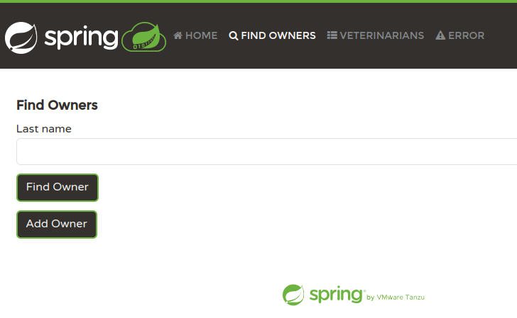
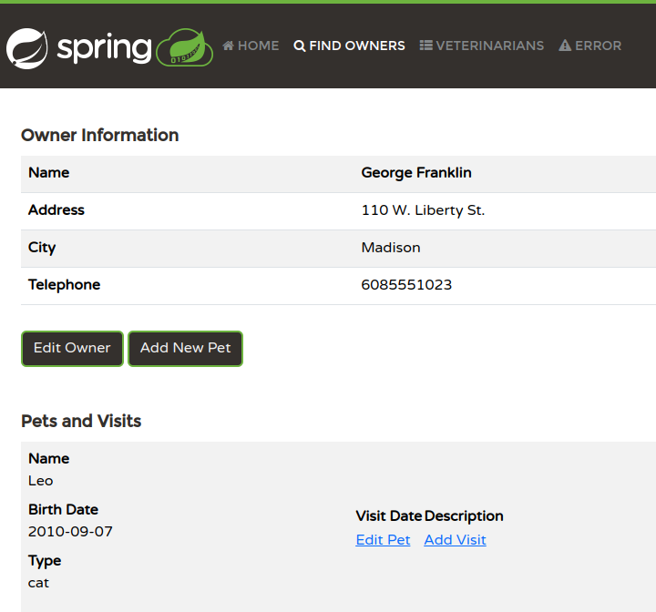
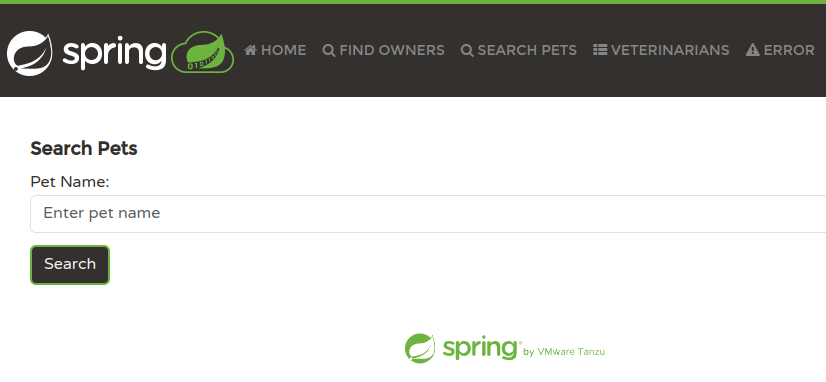
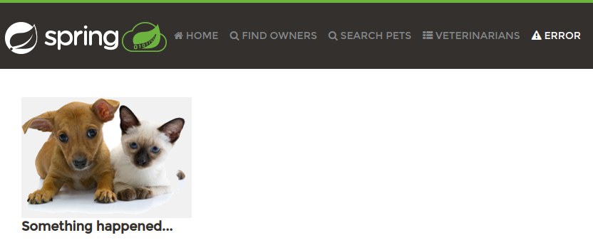
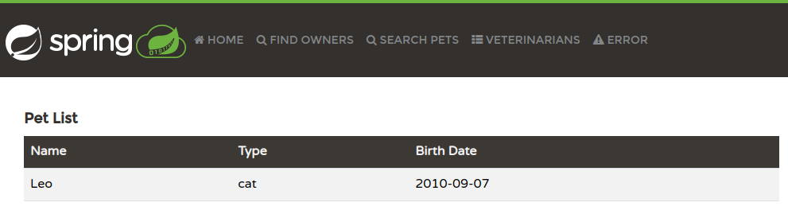

# Generate Feature

Can AI generate a new feature? 

In the [Spring Petclinic](https://github.com/spring-projects/spring-petclinic) you can search for the owners.

Run it as follows:
```shell
mvn spring-boot:run
```



Search for 'Franklin'



Now you would like to have similar functionality for finding pets.

## Setup
Ollama, qwen2.5-coder, CPU

## Prompt
Add the src directory to the prompt context and enter the prompt.
```text
I want to add a page where I can search for pets, similar functionality as for finding owners. Generate the code for it.
```

## Response

---

To create a search page for pets in your Spring Boot application, you'll need to follow these steps:

1. **Create a new controller method** to handle the pet search.
2. **Update the HTML template** to include a form for searching pets.
3. **Add a service method** to perform the search logic.

Here's how you can do it:

### Step 1: Create a New Controller Method

First, create a new controller method in your `OwnerController` or a new controller if you prefer. Let's assume we'll add it to the `OwnerController`.

```java
@Controller
public class OwnerController {

    @Autowired
    private OwnerService ownerService;

    @Autowired
    private PetService petService; // Add this line

    // Existing methods...

    @GetMapping("/owners/search")
    public String searchOwners(@RequestParam(required = false) String lastName, Model model) {
        List<Owner> owners = ownerService.findByLastName(lastName);
        model.addAttribute("owners", owners);
        return "owners/list";
    }

    @PostMapping("/owners/search")
    public String searchPets(@RequestParam(required = false) String name, Model model) {
        List<Pet> pets = petService.findByName(name); // Add this line
        model.addAttribute("pets", pets);
        return "pets/list"; // Create a new template for listing pets
    }
}
```

### Step 2: Update the HTML Template

Create a new HTML template `search-pets.html` in the `src/main/resources/templates/pets/` directory.

```html
<!DOCTYPE html>
<html xmlns:th="https://www.thymeleaf.org" th:replace="~{fragments/layout :: layout (~{::body},'search')}">

  <body>

    <h2>Search Pets</h2>
    <form method="post" action="/owners/search">
      <div class="form-group">
        <label for="name">Pet Name:</label>
        <input type="text" class="form-control" id="name" name="name" placeholder="Enter pet name">
      </div>
      <button type="submit" class="btn btn-primary">Search</button>
    </form>

  </body>

</html>
```

### Step 3: Add a Service Method

Create a new service method in your `PetService` to handle the search logic.

```java
@Service
public class PetService {

    @Autowired
    private PetRepository petRepository;

    public List<Pet> findByName(String name) {
        return petRepository.findByName(name);
    }
}
```

### Step 4: Create a New Template for Listing Pets

Create a new HTML template `list.html` in the `src/main/resources/templates/pets/` directory.

```html
<!DOCTYPE html>
<html xmlns:th="https://www.thymeleaf.org" th:replace="~{fragments/layout :: layout (~{::body},'list')}">

  <body>

    <h2>Pet List</h2>
    <table class="table table-striped">
      <thead>
        <tr>
          <th>Name</th>
          <th>Type</th>
          <th>Birth Date</th>
        </tr>
      </thead>
      <tbody>
        <tr th:each="pet : ${pets}">
          <td th:text="${pet.name}"></td>
          <td th:text="${pet.type}"></td>
          <td th:text="${#dates.format(pet.birthDate, 'yyyy-MM-dd')}"></td>
        </tr>
      </tbody>
    </table>

  </body>

</html>
```

### Step 5: Update the Navigation Menu

Finally, update your navigation menu to include a link to the pet search page.

```html
<nav class="navbar navbar-default">
  <div class="container-fluid">
    <ul class="nav navbar-nav">
      <li><a href="/">Home</a></li>
      <li><a href="/owners">Owners</a></li>
      <li><a href="/pets/search">Search Pets</a></li> <!-- Add this line -->
    </ul>
  </div>
</nav>
```

With these steps, you should now have a search page for pets in your Spring Boot application. When users enter a pet name and submit the form, they will be redirected to a new page displaying the list of matching pets.

---

## Response Analysis
The response is not correct.
* The `PetService` makes use of a `PetRepository`, but this repository does not exist.
*  Although the response suggests to create a new controller, the response does not create a new controller.

## Prompt
Enter a follow-up prompt.
```text
create a separate controller for it, similar to the ownercontroller, the petrepository does not exist, this code is not working, do a better job
```

## Response

---

To create a separate controller for handling pet-related operations in your Spring Boot application, you'll need to follow these steps:

1. **Create a new repository interface** for `Pet`.
2. **Create a new service class** for `Pet`.
3. **Create a new controller class** for handling pet-related requests.
4. **Update the HTML templates** to include forms and views for searching pets.

Here's how you can do it:

### Step 1: Create a New Repository Interface

First, create a new repository interface for `Pet`.

```java
package com.example.demo.repository;

import com.example.demo.model.Pet;
import org.springframework.data.jpa.repository.JpaRepository;

public interface PetRepository extends JpaRepository<Pet, Long> {
    List<Pet> findByName(String name);
}
```

### Step 2: Create a New Service Class

Next, create a new service class for `Pet`.

```java
package com.example.demo.service;

import com.example.demo.model.Pet;
import com.example.demo.repository.PetRepository;
import org.springframework.beans.factory.annotation.Autowired;
import org.springframework.stereotype.Service;

import java.util.List;

@Service
public class PetService {

    @Autowired
    private PetRepository petRepository;

    public List<Pet> findByName(String name) {
        return petRepository.findByName(name);
    }
}
```

### Step 3: Create a New Controller Class

Create a new controller class for handling pet-related requests.

```java
package com.example.demo.controller;

import com.example.demo.model.Pet;
import com.example.demo.service.PetService;
import org.springframework.beans.factory.annotation.Autowired;
import org.springframework.stereotype.Controller;
import org.springframework.ui.Model;
import org.springframework.web.bind.annotation.GetMapping;
import org.springframework.web.bind.annotation.PostMapping;
import org.springframework.web.bind.annotation.RequestParam;

@Controller
public class PetController {

    @Autowired
    private PetService petService;

    @GetMapping("/pets/search")
    public String searchPetsForm() {
        return "pets/search-pets";
    }

    @PostMapping("/pets/search")
    public String searchPets(@RequestParam(required = false) String name, Model model) {
        List<Pet> pets = petService.findByName(name);
        model.addAttribute("pets", pets);
        return "pets/list";
    }
}
```

### Step 4: Update the HTML Templates

Create a new HTML template `search-pets.html` in the `src/main/resources/templates/pets/` directory.

```html
<!DOCTYPE html>
<html xmlns:th="https://www.thymeleaf.org" th:replace="~{fragments/layout :: layout (~{::body},'search')}">

  <body>

    <h2>Search Pets</h2>
    <form method="post" action="/pets/search">
      <div class="form-group">
        <label for="name">Pet Name:</label>
        <input type="text" class="form-control" id="name" name="name" placeholder="Enter pet name">
      </div>
      <button type="submit" class="btn btn-primary">Search</button>
    </form>

  </body>

</html>
```

Create a new HTML template `list.html` in the `src/main/resources/templates/pets/` directory.

```html
<!DOCTYPE html>
<html xmlns:th="https://www.thymeleaf.org" th:replace="~{fragments/layout :: layout (~{::body},'list')}">

  <body>

    <h2>Pet List</h2>
    <table class="table table-striped">
      <thead>
        <tr>
          <th>Name</th>
          <th>Type</th>
          <th>Birth Date</th>
        </tr>
      </thead>
      <tbody>
        <tr th:each="pet : ${pets}">
          <td th:text="${pet.name}"></td>
          <td th:text="${pet.type}"></td>
          <td th:text="${#dates.format(pet.birthDate, 'yyyy-MM-dd')}"></td>
        </tr>
      </tbody>
    </table>

  </body>

</html>
```

### Step 5: Update the Navigation Menu

Finally, update your navigation menu to include a link to the pet search page.

```html
<nav class="navbar navbar-default">
  <div class="container-fluid">
    <ul class="nav navbar-nav">
      <li><a href="/">Home</a></li>
      <li><a href="/owners">Owners</a></li>
      <li><a href="/pets/search">Search Pets</a></li> <!-- Add this line -->
    </ul>
  </div>
</nav>
```

With these steps, you should now have a separate controller for handling pet-related operations in your Spring Boot application. When users enter a pet name and submit the form, they will be redirected to a new page displaying the list of matching pets.

---

## Response Analysis
This response is already better:
* The repository is created
* A separate controller is created, although it has the same name as the already existing `PetController`. Rename it to `PetSearchController`.
* New imports are added from package `com.example.demo` followed by `repository`, `service`, `controller`. Although this seems to be a good convention to follow, it is not how the Spring Petclinic is setup. So, remove the imports.
* Similar for the package names, these are not correct.
* In **Step 5**, the navigation menu needs to be updated. This is located in `layout.html`. This change is not correct. It should be:
```html
<li th:replace="~{::menuItem ('/pets/search','pets','search pets','search','Search Pets')}">
    <span class="fa fa-search" aria-hidden="true"></span>
    <span>Search Pets</span>
</li>* 
```

First, execute the following command, otherwise the build will fail.
```shell
mvn spring-javaformat:apply
```

Run the application.

In the navigation menu, a **Search Pets** menu item is available. 



Enter **Leo** and click the **Search** button.

This results in an error.


In the console the error is shown:
```shell
2025-01-04T11:37:57.796+01:00 ERROR 18992 --- [nio-8080-exec-5] org.thymeleaf.TemplateEngine             : [THYMELEAF][http-nio-8080-exec-5] Exception processing template "pets/list": Exception evaluating SpringEL expression: "#dates.format(pet.birthDate, 'yyyy-MM-dd')" (template: "pets/list" - line 19, col 9)
```

## Prompt
Let's ask to fix it in a follow-up prompt.
```text
When clicking the search button, the following error occurs, how should it be fixed? 2025-01-04T11:37:57.796+01:00 ERROR 18992 --- [nio-8080-exec-5] org.thymeleaf.TemplateEngine : [THYMELEAF][http-nio-8080-exec-5] Exception processing template "pets/list": Exception evaluating SpringEL expression: "#dates.format(pet.birthDate, 'yyyy-MM-dd')" (template: "pets/list" - line 19, col 9)
```

## Response

---

The error you're encountering is due to the fact that Thymeleaf cannot find the `#dates` object. This typically happens when the Spring Security configuration is not properly set up or when the necessary dependencies are missing.

To fix this issue, ensure that you have the following in your `pom.xml` (if you're using Maven) or `build.gradle` (if you're using Gradle):

### For Maven
```xml
<dependency>
    <groupId>org.springframework.boot</groupId>
    <artifactId>spring-boot-starter-thymeleaf</artifactId>
</dependency>
```

### For Gradle
```groovy
implementation 'org.springframework.boot:spring-boot-starter-thymeleaf'
```

Additionally, ensure that you have the necessary Spring Security dependencies if you're using it. If not, you can remove any security-related configurations.

If you don't need Spring Security, you can simply remove or comment out any security-related configuration in your `application.properties` or `application.yml`.

### Example of Removing Security Configuration

If you have a security configuration class like this:

```java
package com.example.demo.config;

import org.springframework.context.annotation.Configuration;
import org.springframework.security.config.annotation.web.builders.HttpSecurity;
import org.springframework.security.config.annotation.web.configuration.EnableWebSecurity;
import org.springframework.security.config.annotation.web.configuration.WebSecurityConfigurerAdapter;

@Configuration
@EnableWebSecurity
public class SecurityConfig extends WebSecurityConfigurerAdapter {

    @Override
    protected void configure(HttpSecurity http) throws Exception {
        http.authorizeRequests()
            .anyRequest().authenticated()
            .and()
            .formLogin();
    }
}
```

You can remove it or comment it out:

```java
// package com.example.demo.config;

// import org.springframework.context.annotation.Configuration;
// import org.springframework.security.config.annotation.web.builders.HttpSecurity;
// import org.springframework.security.config.annotation.web.configuration.EnableWebSecurity;
// import org.springframework.security.config.annotation.web.configuration.WebSecurityConfigurerAdapter;

// @Configuration
// @EnableWebSecurity
// public class SecurityConfig extends WebSecurityConfigurerAdapter {

//     @Override
//     protected void configure(HttpSecurity http) throws Exception {
//         http.authorizeRequests()
//             .anyRequest().authenticated()
//             .and()
//             .formLogin();
//     }
// }
```

After making these changes, restart your application and try clicking the search button again. This should resolve the error related to the `#dates` object not being found.

---

## Response Analysis
The first sentence in the response is actually spot on: _The error you're encountering is due to the fact that Thymeleaf cannot find the #dates object._

But the solutions are not correct. I checked the `createOrUpdateVisitForm.html` file where also date formatting is used. There I saw that `#temporals` is used instead of `#dates`. Changed it and ran the application again.

Search for **Leo** again and now **Leo** is returned.



## End Conclusion
Are we able to create a new feature using AI? Well, yes, it was successful in the end, after a few iterations. The code is probably not exactly what we wanted. The source code is quite different from the implementation of the `OwnerController.processFindForm` and no pagination is added.

The end result can be found [here](https://github.com/mydeveloperplanet/devoxxgenie-spring-petclinic/tree/feature/search-pets-local-llm)