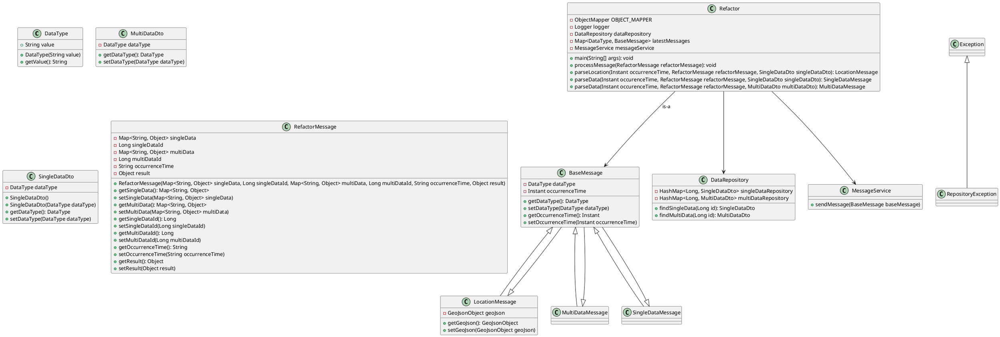

Certainly! Below is the PlantUML class diagram for the provided code:

```plantuml
@startuml

class DataType {
  +String value
  +DataType(String value)
  +getValue(): String
}

class Refactor {
  -ObjectMapper OBJECT_MAPPER
  -Logger logger
  -DataRepository dataRepository
  -Map<DataType, BaseMessage> latestMessages
  -MessageService messageService
  +main(String[] args): void
  +processMessage(RefactorMessage refactorMessage): void
  +parseLocation(Instant occurrenceTime, RefactorMessage refactorMessage, SingleDataDto singleDataDto): LocationMessage
  +parseData(Instant occurenceTime, RefactorMessage refactorMessage, SingleDataDto singleDataDto): SingleDataMessage
  +parseData(Instant occurenceTime, RefactorMessage refactorMessage, MultiDataDto multiDataDto): MultiDataMessage
}

class BaseMessage {
  -DataType dataType
  -Instant occurrenceTime
  +getDataType(): DataType
  +setDataType(DataType dataType)
  +getOccurrenceTime(): Instant
  +setOccurrenceTime(Instant occurrenceTime)
}

class MultiDataDto {
  -DataType dataType
  +getDataType(): DataType
  +setDataType(DataType dataType)
}

class SingleDataDto {
  -DataType dataType
  +SingleDataDto()
  +SingleDataDto(DataType dataType)
  +getDataType(): DataType
  +setDataType(DataType dataType)
}

class DataRepository {
  -HashMap<Long, SingleDataDto> singleDataRepository
  -HashMap<Long, MultiDataDto> multiDataRepository
  +findSingleData(Long id): SingleDataDto
  +findMultiData(Long id): MultiDataDto
}

class MessageService {
  +sendMessage(BaseMessage baseMessage)
}

class LocationMessage extends BaseMessage {
  -GeoJsonObject geoJson
  +getGeoJson(): GeoJsonObject
  +setGeoJson(GeoJsonObject geoJson)
}

class RefactorMessage {
  -Map<String, Object> singleData
  -Long singleDataId
  -Map<String, Object> multiData
  -Long multiDataId
  -String occurrenceTime
  -Object result
  +RefactorMessage(Map<String, Object> singleData, Long singleDataId, Map<String, Object> multiData, Long multiDataId, String occurrenceTime, Object result)
  +getSingleData(): Map<String, Object>
  +setSingleData(Map<String, Object> singleData)
  +getMultiData(): Map<String, Object>
  +setMultiData(Map<String, Object> multiData)
  +getSingleDataId(): Long
  +setSingleDataId(Long singleDataId)
  +getMultiDataId(): Long
  +setMultiDataId(Long multiDataId)
  +getOccurrenceTime(): String
  +setOccurrenceTime(String occurrenceTime)
  +getResult(): Object
  +setResult(Object result)
}

class MultiDataMessage extends BaseMessage

class SingleDataMessage extends BaseMessage

class RepositoryException extends Exception

Refactor --> DataRepository
Refactor --> MessageService
Refactor --> BaseMessage : is-a
LocationMessage <|-- BaseMessage
SingleDataMessage <|-- BaseMessage
MultiDataMessage <|-- BaseMessage

@enduml
```

You can copy and paste this code into a PlantUML editor to generate the class diagram.