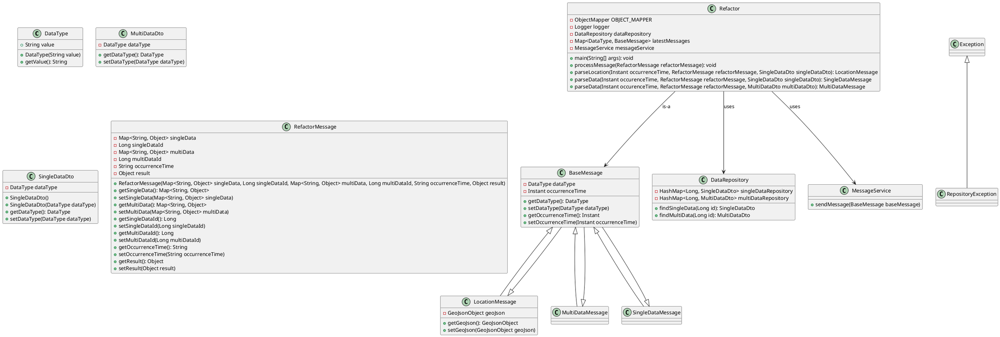

Certainly! Here are some suggestions to improve the PlantUML diagram based on the provided Java code:

1. **Consistent Naming**: Ensure that all classes, methods, and attributes are consistently named according to their actual implementations.
2. **Relationships**: Clearly define relationships between classes, such as inheritance and associations.
3. **Visibility**: Use appropriate visibility modifiers (public, private, protected) to reflect the access levels in the code.
4. **Comments**: Add comments to explain complex parts of the diagram.

Here's an improved version of your PlantUML diagram:

### Key Changes:
1. **Visibility**: Added visibility modifiers to methods and attributes.
2. **Relationships**: Used `uses` instead of `-->` for relationships that are not direct inheritance or association.
3. **Comments**: Added comments to explain the diagram.

This should provide a clearer and more accurate representation of your codebase in PlantUML.