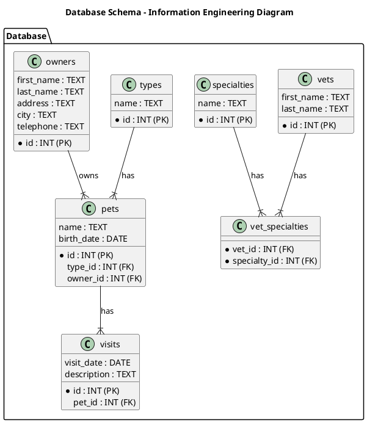
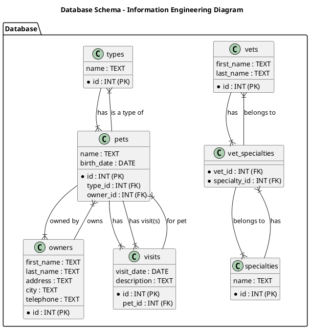
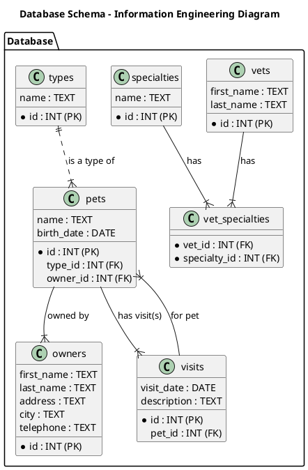
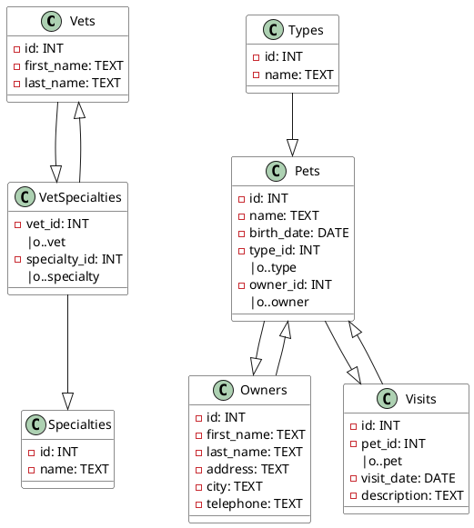
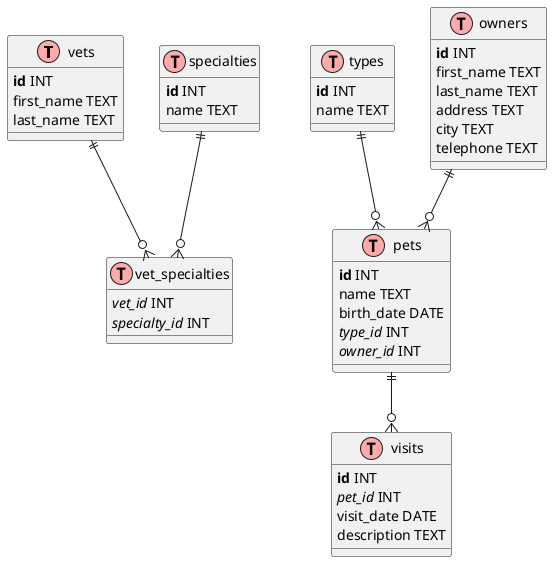
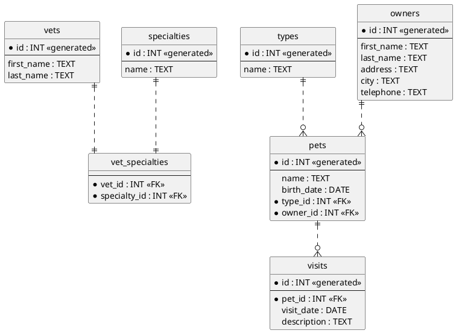

# Generate PlantUML from SQL

Writing documentation can be a tedious task. Let's investigate whether AI can generate a PlantUML from a PostgreSQL [postgres-schema.sql](sources/postgres-schema.sql) which is taken from the [Spring Petclinic](https://github.com/spring-projects/spring-petclinic/blob/main/src/main/resources/db/postgres/schema.sql).

The goal is to create a database diagram according to [Information Engineering Diagrams](https://plantuml.com/ie-diagram)

## Setup
Ollama, qwen2.5-coder, CPU

## Prompt
Open the file [postgres-schema.sql](sources/postgres-schema.sql) and in a new chat window, enter the prompt.
```text
create a plantuml file from this code using Information Engineering Diagrams
```

# Response

---

To create a PlantUML file using Information Engineering Diagrams for the provided SQL schema, you can use the following code:



This PlantUML code will generate an Information Engineering Diagram that visually represents the relationships between the tables in your SQL schema.

---

## Response Analysis
The diagram is saved in [1-db.puml](responses/1-db.puml) and a png representation is located in [1-db.png](responses/1-db.png).

The response is quite good, the tables are correct, but the relations are only set in one direction and the cardinality is also not correct.

## Prompt
I would like to have the relations two-way, I do not want a name for the relations and I would like to have dots instead of dashes for defining the relations. In the same chat window, enter the prompt.
```text
the relations should be two-way, now they are only one way. Use the following convention for relations:
zero or one `|o..`
exactly one `||..`
zero or many `}o..`
one or many `}|..`
```

## Response

---

To make the relations two-way according to the specified convention, you need to adjust the PlantUML code as follows:



This updated PlantUML code will create two-way relationships between the tables, using the specified notation.

---

## Response Analysis
The diagram is saved in [2-db.puml](responses/2-db.puml) and a png representation is located in [2-db.png](responses/2-db.png).

The relations are two-way, but this was not exactly what I intended. The instructions that the relations should be defined with dots and that the relations should not have names are completely ignored.

## Prompt
Final attempt, let's add an example to the prompt.
```text
the relations between types and pets should be defined as the following example. So, do not create two separate relations.
Example:
`Pets ||..|{ Types`
```

## Response

---

To define the relationship between `types` and `pets` as specified in your example, you need to adjust the PlantUML code accordingly. Here is the updated version of your file:



In this updated code, the relationship between `types` and `pets` is defined as `TYPES ||..|{ PETS : is a type of`, which indicates that each pet belongs to exactly one type.

---

## Response Analysis
The diagram is saved in [3-db.puml](responses/3-db.puml) and a png representation is located in [3-db.png](responses/3-db.png).

Only the provided example has been changed, the other relations are still with dashes and the relations are given a name. Instructions are ignored.

Adding the relations seems to be too difficult. Anyway, creating the tables did save us time.

## Prompt
Let's try another model, like llama3.2:3b. Open a new chat window and enter the prompt.
```text
create a plantuml file from this code using Information Engineering Diagrams
Use the following convention for relations:
zero or one `|o..`
exactly one `||..`
zero or many `}o..`
one or many `}|..`
```

## Response

---

**PlantUML Code Generation**
==========================

Below is the PlantUML code generated from the provided SQL schema:

This PlantUML code represents the relationships between the entities in the provided SQL schema. The `@startuml` and `@enduml` directives define the start and end of the diagram, respectively. The `skinparam` directives configure the appearance of the classes.

The classes are defined with their properties (e.g., `id`, `first_name`, etc.) and relationships (e.g., `vet_id: INT`, `pet_id: INT`, etc.). The `|o..` notation represents zero or one relationships, while `||..` represents exactly one relationship.

---

## Response Analysis
The diagram is saved in [4-db.puml](responses/4-db.puml) and a png representation is located in [4-db.png](responses/4-db.png).

The response is worse. The Information Engineering Diagrams are not used, the tables are incorrect (especially the mandatory fields).

Model qwen2.5-coder did after all not a bad job.

## Prompt
Which result can we achieve when using an online LLM like Anthropic Claude 3.5 Sonnet?

Open a new chat window and enter the prompt.
```text
create a plantuml file from this code using Information Engineering Diagrams
```

## Response

---

I'll help you create a PlantUML file using Information Engineering (IE) notation for your database schema. Here's the corresponding PlantUML diagram:



This PlantUML diagram:

1. Uses IE notation to represent the database schema
2. Shows all tables with their respective columns
3. Marks primary keys in **bold**
4. Marks foreign keys in *italic*
5. Shows relationships between tables using proper cardinality notation:
    - `||--o{` represents a "one-to-many" relationship
    - The connecting lines show which tables are related through foreign keys

The diagram includes all seven tables from your schema:
- vets
- specialties
- vet_specialties (junction table)
- types
- owners
- pets
- visits

You can copy this code into a `.puml` file and use a PlantUML renderer to generate the visual diagram.

---

## Response Analysis
The diagram is saved in [5-db.puml](responses/5-db.puml) and a png representation is located in [5-db.png](responses/5-db.png).

This seems to be give a better result, only the Information Engineering Diagrams are not used.

## Prompt
Apparently, Claude does not know the IE syntax, so let's give the instructions in the prompt.
```text
the IE notation is not used. The IE notation is as follows:
This extension adds:
Additional relations for the Information Engineering notation;
An entity alias that maps to the class diagram class;
An additional visibility modifier * to identify mandatory attributes.
Otherwise, the syntax for drawing diagrams is the same as for class diagrams. All other features of class diagrams are also supported.
Example:
===
@startuml

' hide the spot
' hide circle

' avoid problems with angled crows feet
skinparam linetype ortho

entity "User" as e01 {
*user_id : number <<generated>>
--
*name : text
description : text
}

entity "Card" as e02 {
*card_id : number <<generated>>
sync_enabled: boolean
version: number
last_sync_version: number
--
*user_id : number <<FK>>
other_details : text
}

entity "CardHistory" as e05 {
*card_history_id : number <<generated>>
version : number
--
*card_id : number <<FK>>
other_details : text
}

entity "CardsAccounts" as e04 {
*id : number <<generated>>
--
card_id : number <<FK>>
account_id : number <<FK>>
other_details : text
}


entity "Account" as e03 {
*account_id : number <<generated>>
--
user_id : number <<FK>>
other_details : text
}

entity "Stream" as e06 {
*id : number <<generated>>
version: number
searchingText: string
--
owner_id : number <<FK>>
follower_id : number <<FK>>
card_id: number <<FK>>
other_details : text
}


e01 }|..|| e02
e01 }|..|| e03

e02 }|..|| e05

e02 }|..|| e04
e03 }|..|| e04

e02 }|..|| e06
e03 }|..|| e06


@enduml
===
```

## Response

---

You're right. Let me correct the PlantUML diagram using proper IE notation:



Key changes made:
1. Used proper `entity` instead of `table`
2. Added proper IE notation for relationships using `||..||` and `||..o{`
3. Marked primary keys and foreign keys with proper notation
4. Used `*` to denote mandatory fields
5. Added `<<generated>>` for auto-generated IDs
6. Added `<<FK>>` for foreign keys
7. Used `--` to separate primary keys from other fields
8. Added proper skinparam settings for IE notation

This diagram now correctly follows the Information Engineering notation standards while representing your database schema.

---

## Response Analysis
The diagram is saved in [6-db.puml](responses/6-db.puml) and a png representation is located in [6-db.png](responses/6-db.png).

This is quite ok. 'hide circle' should be commented out, the relations are not correct. The instructions are followed, but even voor Claude 3.5 Sonnet are the relations too complex.

## End Conclusion
Both offline and online LLMs are able to generate the tables correctly. Both have problems with the relations. 

Some techniques for improving the response are used:
* tell the LLM what is wrong with the response
* use examples
* use a different model
* try to give clearer instructions