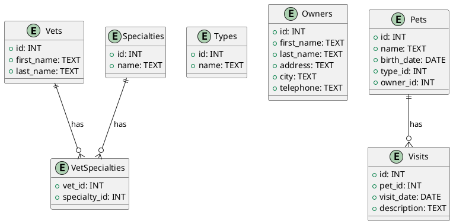
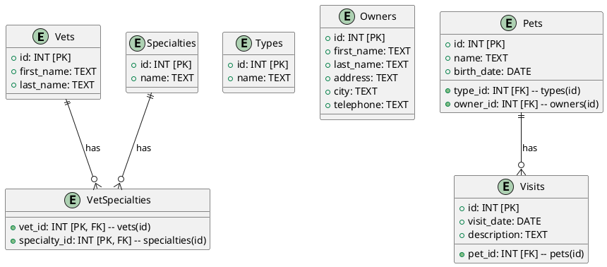
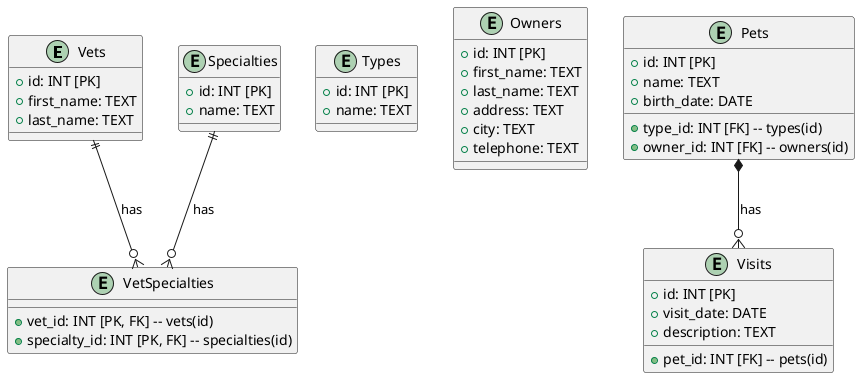
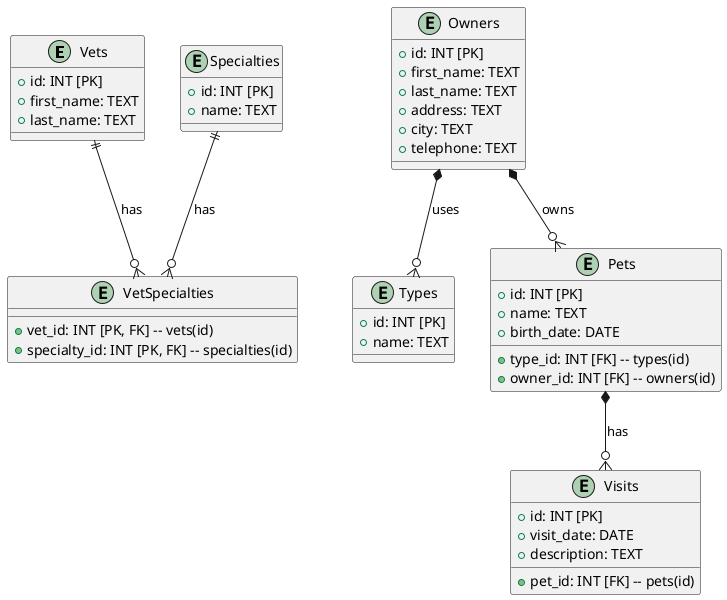
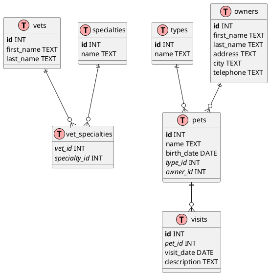
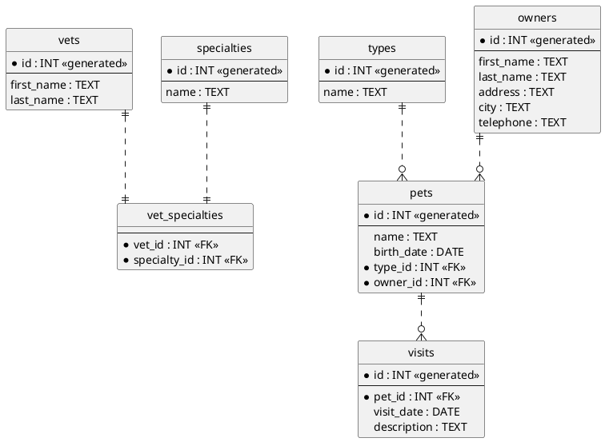

# Generate PlantUML from SQL

Writing documentation can be a tedious task. Let's investigate whether AI can generate a PlantUML from a PostgreSQL [postgres-schema.sql](sources/postgres-schema.sql) which is taken from the [Spring Petclinic](https://github.com/spring-projects/spring-petclinic/blob/main/src/main/resources/db/postgres/schema.sql).

The goal is to create a database diagram according to [Information Engineering Diagrams](https://plantuml.com/ie-diagram)

## Setup
LMStudio, qwen2.5-coder, GPU

## Prompt
Open the file [postgres-schema.sql](sources/postgres-schema.sql) and in a new chat window, enter the prompt.
```text
create a plantuml file from this code using Information Engineering Diagrams
```

# Response

---

To create a PlantUML file from the given PostgreSQL schema using Information Engineering Diagrams, you can use the following syntax:



This PlantUML code will generate an Information Engineering Diagram that represents the relationships between the tables in your PostgreSQL schema.

---

## Response Analysis
The diagram is saved in [1-db.puml](responses/1-db.puml) and a png representation is located in [1-db.png](responses/1-db.png).

The response is quite good, the tables are correct and it is according to the Information Engineering Diagrams. However, some issues exist:
* the primary and foreign keys are not shown
* the relations are incomplete
* the relations are defined in the wrong direction

## Prompt
Let's try to solve the primary and foreign keys issue first.

Enter the prompt.

```text
the primary and foreign keys are not shown in the tables and they are mandatory
```

## Response

---

To include the primary and foreign keys in the PlantUML diagram, you can modify the code as follows:



This PlantUML code now includes the primary and foreign keys in the tables, making it clear which columns are used for these purposes.

---

## Response Analysis

The diagram is saved in [2-db.puml](responses/2-db.puml) and a png representation is located in [2-db.png](responses/2-db.png).

The response did improve:
* The primary keys and foreign keys are added now.
* Only the foreign keys are mandatory, not the primary keys. Also the primary keys are mandatory.

## Prompt
Let's try to fix the relations. Enter the prompt.

```text
Not all relations are drawn and the cardinality seems to be the other way around.
```

## Response

---

To correct the cardinality and ensure that all relationships are properly drawn in the PlantUML diagram, you can adjust the code as follows:



In this updated code:
- The `VetSpecialties` table is correctly linked to both `Vets` and `Specialties`.
- The `Pets` table is linked to the `Visits` table with a one-to-many relationship, indicating that each pet can have multiple visits.

This should ensure that all relationships are properly drawn and the cardinality is correct.

---

## Response Analysis
The diagram is saved in [3-db.puml](responses/3-db.puml) and a png representation is located in [3-db.png](responses/3-db.png).

This did not make any significant difference.

## Prompt
Let's try to be more specific. Enter the prompt.

```text
The relations between owners and pets, and between owners and types are missing.
```

## Response

---

To include the missing relationships between `Owners` and `Pets`, as well as between `Owners` and `Types`, you can update the PlantUML code as follows:



In this updated code:
- The `Owners` table is linked to the `Pets` table with a one-to-many relationship, indicating that each owner can have multiple pets.
- The `Owners` table is also linked to the `Types` table with a one-to-many relationship, indicating that each owner can use multiple types.

This should include all the necessary relationships in your PlantUML diagram.

---

## Response Analysis

The diagram is saved in [4-db.puml](responses/4-db.puml) and a png representation is located in [4-db.png](responses/4-db.png).

The missing relations are added, but still in the wrong direction and with a slightly different syntax than in the Information Engineering Diagrams.

## Prompt
Which result can we achieve when using an online LLM like Anthropic Claude 3.5 Sonnet?

Open a new chat window and enter the prompt.
```text
create a plantuml file from this code using Information Engineering Diagrams
```

## Response

---

I'll help you create a PlantUML file using Information Engineering (IE) notation for your database schema. Here's the corresponding PlantUML diagram:



This PlantUML diagram:

1. Uses IE notation to represent the database schema
2. Shows all tables with their respective columns
3. Marks primary keys in **bold**
4. Marks foreign keys in *italic*
5. Shows relationships between tables using proper cardinality notation:
    - `||--o{` represents a "one-to-many" relationship
    - The connecting lines show which tables are related through foreign keys

The diagram includes all seven tables from your schema:
- vets
- specialties
- vet_specialties (junction table)
- types
- owners
- pets
- visits

You can copy this code into a `.puml` file and use a PlantUML renderer to generate the visual diagram.

---

## Response Analysis
The diagram is saved in [5-db.puml](responses/5-db.puml) and a png representation is located in [5-db.png](responses/5-db.png).

This seems to be a better result, only the Information Engineering Diagrams are not used.

## Prompt
Apparently, Claude does not know the IE syntax, so let's give the instructions in the prompt.
```text
the IE notation is not used. The IE notation is as follows:
This extension adds:
Additional relations for the Information Engineering notation;
An entity alias that maps to the class diagram class;
An additional visibility modifier * to identify mandatory attributes.
Otherwise, the syntax for drawing diagrams is the same as for class diagrams. All other features of class diagrams are also supported.
Example:
===
@startuml

' hide the spot
' hide circle

' avoid problems with angled crows feet
skinparam linetype ortho

entity "User" as e01 {
*user_id : number <<generated>>
--
*name : text
description : text
}

entity "Card" as e02 {
*card_id : number <<generated>>
sync_enabled: boolean
version: number
last_sync_version: number
--
*user_id : number <<FK>>
other_details : text
}

entity "CardHistory" as e05 {
*card_history_id : number <<generated>>
version : number
--
*card_id : number <<FK>>
other_details : text
}

entity "CardsAccounts" as e04 {
*id : number <<generated>>
--
card_id : number <<FK>>
account_id : number <<FK>>
other_details : text
}


entity "Account" as e03 {
*account_id : number <<generated>>
--
user_id : number <<FK>>
other_details : text
}

entity "Stream" as e06 {
*id : number <<generated>>
version: number
searchingText: string
--
owner_id : number <<FK>>
follower_id : number <<FK>>
card_id: number <<FK>>
other_details : text
}


e01 }|..|| e02
e01 }|..|| e03

e02 }|..|| e05

e02 }|..|| e04
e03 }|..|| e04

e02 }|..|| e06
e03 }|..|| e06


@enduml
===
```

## Response

---

You're right. Let me correct the PlantUML diagram using proper IE notation:



Key changes made:
1. Used proper `entity` instead of `table`
2. Added proper IE notation for relationships using `||..||` and `||..o{`
3. Marked primary keys and foreign keys with proper notation
4. Used `*` to denote mandatory fields
5. Added `<<generated>>` for auto-generated IDs
6. Added `<<FK>>` for foreign keys
7. Used `--` to separate primary keys from other fields
8. Added proper skinparam settings for IE notation

This diagram now correctly follows the Information Engineering notation standards while representing your database schema.

---

## Response Analysis
The diagram is saved in [6-db.puml](responses/6-db.puml) and a png representation is located in [6-db.png](responses/6-db.png).

This is quite ok. 
* 'hide circle' should be commented out
* the relations are not correct. 
* The instructions are followed, but even voor Claude 3.5 Sonnet the relations too complex to draw.

## End Conclusion
Both offline and online LLMs are able to generate the tables correctly. Both have problems with the relations. 

Some techniques for improving the response are used:
* tell the LLM what is wrong with the response
* use examples
* use a different model
* try to give clearer instructions