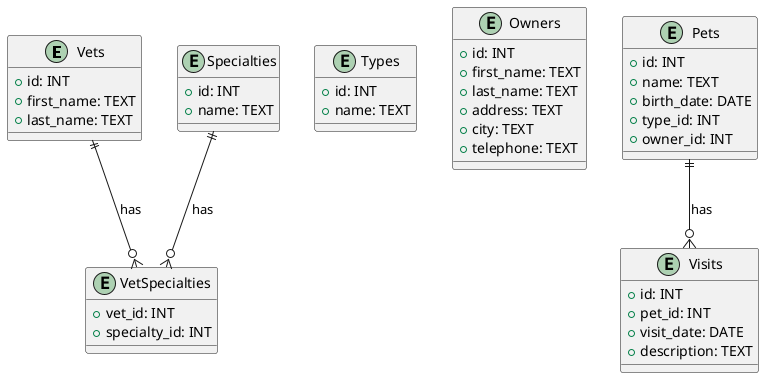

To create a PlantUML file from the given PostgreSQL schema using Information Engineering Diagrams, you can use the following syntax:

This PlantUML code will generate an Information Engineering Diagram that represents the relationships between the tables in your PostgreSQL schema.