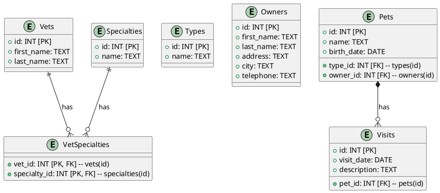

To correct the cardinality and ensure that all relationships are properly drawn in the PlantUML diagram, you can adjust the code as follows:

In this updated code:
- The `VetSpecialties` table is correctly linked to both `Vets` and `Specialties`.
- The `Pets` table is linked to the `Visits` table with a one-to-many relationship, indicating that each pet can have multiple visits.

This should ensure that all relationships are properly drawn and the cardinality is correct.