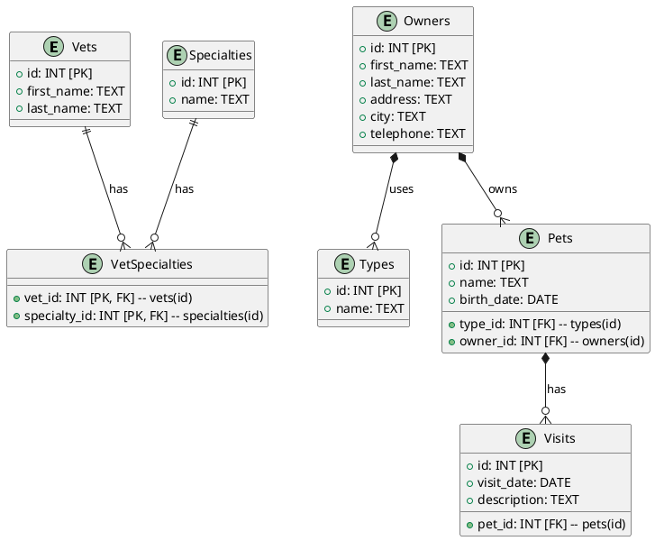

To include the missing relationships between `Owners` and `Pets`, as well as between `Owners` and `Types`, you can update the PlantUML code as follows:

In this updated code:
- The `Owners` table is linked to the `Pets` table with a one-to-many relationship, indicating that each owner can have multiple pets.
- The `Owners` table is also linked to the `Types` table with a one-to-many relationship, indicating that each owner can use multiple types.

This should include all the necessary relationships in your PlantUML diagram.