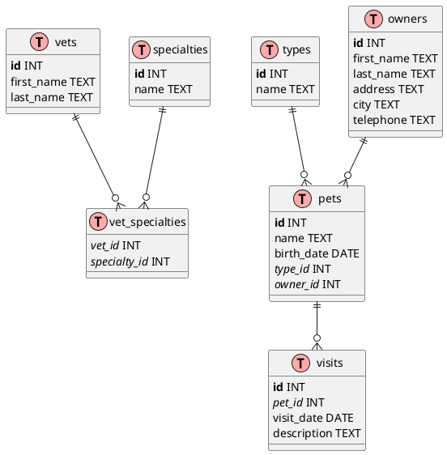

I'll help you create a PlantUML file using Information Engineering (IE) notation for your database schema. Here's the corresponding PlantUML diagram:

This PlantUML diagram:

1. Uses IE notation to represent the database schema
2. Shows all tables with their respective columns
3. Marks primary keys in **bold**
4. Marks foreign keys in *italic*
5. Shows relationships between tables using proper cardinality notation:
    - `||--o{` represents a "one-to-many" relationship
    - The connecting lines show which tables are related through foreign keys

The diagram includes all seven tables from your schema:
- vets
- specialties
- vet_specialties (junction table)
- types
- owners
- pets
- visits

You can copy this code into a `.puml` file and use a PlantUML renderer to generate the visual diagram.