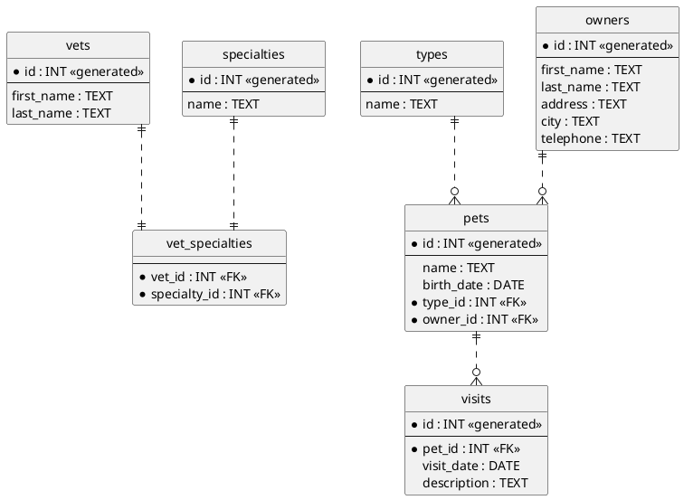

You're right. Let me correct the PlantUML diagram using proper IE notation:

Key changes made:
1. Used proper `entity` instead of `table`
2. Added proper IE notation for relationships using `||..||` and `||..o{`
3. Marked primary keys and foreign keys with proper notation
4. Used `*` to denote mandatory fields
5. Added `<<generated>>` for auto-generated IDs
6. Added `<<FK>>` for foreign keys
7. Used `--` to separate primary keys from other fields
8. Added proper skinparam settings for IE notation

This diagram now correctly follows the Information Engineering notation standards while representing your database schema.