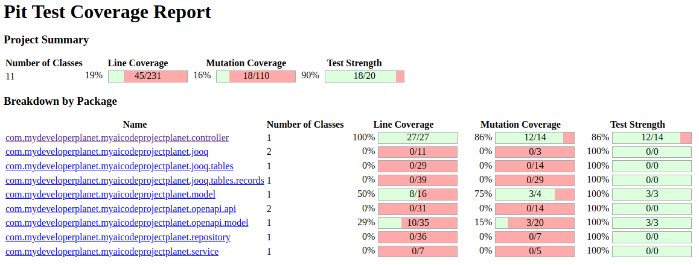
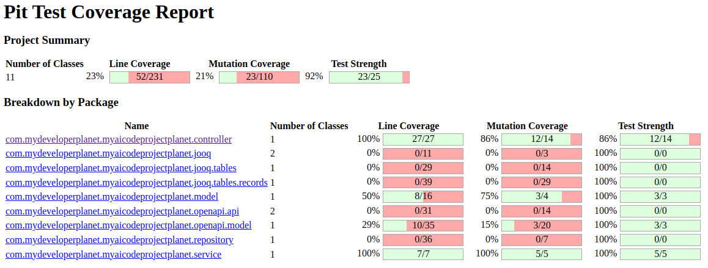
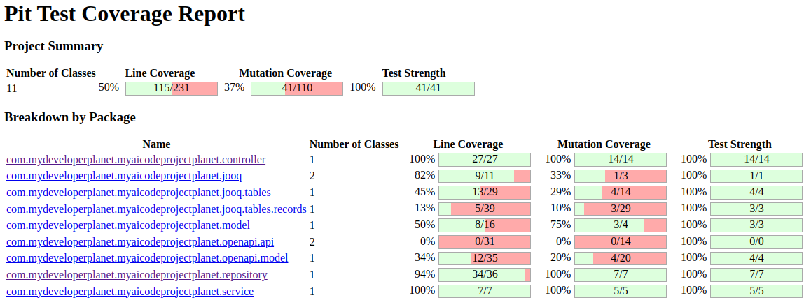

# Generate Unit Tests
Can you generate unit tests for a Spring Boot Application using an AI coding assistant?

The Spring Boot application created in [Generate Spring Boot Application](../generate-spring-boot-app/README.md) is used as a [starting point](https://github.com/mydeveloperplanet/myaicodeprojectplanet/tree/feature/run-application).

## Setup
LMStudio, qwen2.5-coder, GPU

## Generate Controller Test
Let's create a unit test for the `CustomersController` class.

### Prompt
The command utility `/test` expands to the following prompt.
```text
Write a unit test for this code using JUnit.
```
Using this prompt will generate a more general test.

For a Controller test, the following requirements apply:
* WebMvcTest must be used;
* MockMvc must be used;
* AssertJ assertions must be used.

Open file `CustomersController` and enter the prompt.
```text
Write a unit test for this code using JUnit.
Use WebMvcTest.
Use MockMvc.
Use AssertJ assertions.
```

### Response
The response can be viewed [here](responses/1-1-test-controller).

### Apply Response
Create package `com/mydeveloperplanet/myaicodeprojectplanet/controller` in the `src/test/java` directory and copy the response in file `CustomersControllerTest`.

Some issues exist:
* Imports need to be added, but IntelliJ will help you with that.
* The `convertToDomainModel` method from the `CustomersController` is used, but this is a private method.

### Prompt
Enter a follow-up prompt.
```text
The convertToDomainModel method is used, but is not accessible. 
Create the Customer object in a similar way as the openAPICustomer object.
```

### Response
The response can be viewed [here](responses/1-2-controller-test.md).

### Apply Response
A `convertToDomainModel` method is added to the test.

Again, fix the imports. The test class does compile now and the tests can be executed and are successful.

Looking at the tests themselves, they look quite ok, but the code can be improved: 
* The `testCustomersPost` should not contain the id in the request.
* The Post and Put JSON content could be text blocks.
* Maybe the `convertToDomainModel` should not be used because it is to close to the implementation.

### Test Quality
Can you check the test quality? Of course, you can test the quality of your tests by means of mutation tests (`pitest-maven` plugin).

Add the following plugin to the build-section of the pom. 
```xml
<plugin>
    <groupId>org.pitest</groupId>
    <artifactId>pitest-maven</artifactId>
    <version>${pitest-maven.version}</version>
    <dependencies>
        <dependency>
            <groupId>org.pitest</groupId>
            <artifactId>pitest-junit5-plugin</artifactId>
            <version>${pitest-junit5-plugin.version}</version>
        </dependency>
    </dependencies>
    <executions>
        <execution>
            <goals>
                <goal>mutationCoverage</goal>
            </goals>
            <configuration>
                <features>
                    <feature>+auto_threads</feature>
                </features>
                <jvmArgs>
                    <jvmArg>-XX:+EnableDynamicAgentLoading</jvmArg>
                </jvmArgs>
            </configuration>
        </execution>
    </executions>
</plugin>
```

Run the build.
```shell
mvn clean verify
```

In directory `target/pit-reports` the report can be found.

The mutation test result shows a 100% line coverage and an 86% mutation coverage for the `controller` package. This is quite good. This means that the tests still can be improved.


## Generate Service Test
Let's create a unit test for the `CustomerServiceImpl` class.

### Prompt
Open the `CustomerServiceImpl` file and enter the prompt.
```text
Write a unit test for this code using JUnit.
Use AssertJ assertions.
Use Mockito.
```

### Response
The response can be viewed [here](responses/2-1-service-test.md)

### Apply Response
Create package `com.mydeveloperplanet.myaicodeprojectplanet.service` in directory `src/test/java` and copy the response in file `CustomerServiceImplTest`.

Some issues exist"
* You need to fix some imports.
* Some compile errors exist when creating a `Customer`. The constructor needs an id, a first name and a last name.
* The `setUp` method is not really required if you annotate the class with `@ExtendWith(MockitoExtension.class)`

### Prompt
Open a new chat window and add the full project to the Prompt Context. Enter the prompt.
```text
Write a unit test for class CustomerServiceImpl using JUnit.
Use AssertJ assertions.
Use Mockito.
```

### Response
The response can be viewed [here](responses/2-2-service-test.md).

### Apply Response
This did not change much. Less imports were present, but the same problem with the `Customer` object exists. 

Fix this manually and run the tests.

Three tests pass, two fail

Test `testCreateCustomer` fails due to the following error:
```shell
org.opentest4j.AssertionFailedError: 
expected: "Customer{id=1, firstName='John', lastName='Doe'} (Customer@2160e52a)"
 but was: "Customer{id=1, firstName='John', lastName='Doe'} (Customer@3d7cc3cb)"
Expected :Customer{id=1, firstName='John', lastName='Doe'}
Actual   :Customer{id=1, firstName='John', lastName='Doe'}
<Click to see difference>


	at com.mydeveloperplanet.myaicodeprojectplanet.service.CustomerServiceImplTest.testCreateCustomer(CustomerServiceImplTest.java:63)
	at java.base/java.lang.reflect.Method.invoke(Method.java:580)
	at java.base/java.util.ArrayList.forEach(ArrayList.java:1596)
	at java.base/java.util.ArrayList.forEach(ArrayList.java:1596)
```
The domain object does not implement the `equals` method. For now, fix it in the test.
```java
assertThat(result.getId()).isEqualTo(1L);
assertThat(result.getFirstName()).isEqualTo("John");
assertThat(result.getLastName()).isEqualTo("Doe");
```

Test `testUpdateCustomer` fails due to the following error:
```shell
org.mockito.exceptions.misusing.InvalidUseOfMatchersException:
Invalid use of argument matchers!
2 matchers expected, 1 recorded:
-> at com.mydeveloperplanet.myaicodeprojectplanet.service.CustomerServiceImplTest.testUpdateCustomer(CustomerServiceImplTest.java:76)

This exception may occur if matchers are combined with raw values:
//incorrect:
someMethod(any(), "raw String");
When using matchers, all arguments have to be provided by matchers.
For example:
//correct:
someMethod(any(), eq("String by matcher"));

For more info see javadoc for Matchers class.


at com.mydeveloperplanet.myaicodeprojectplanet.repository.CustomerRepository.updateCustomer(CustomerRepository.java:45)
at com.mydeveloperplanet.myaicodeprojectplanet.service.CustomerServiceImplTest.testUpdateCustomer(CustomerServiceImplTest.java:76)
at java.base/java.lang.reflect.Method.invoke(Method.java:580)
at java.base/java.util.ArrayList.forEach(ArrayList.java:1596)
at java.base/java.util.ArrayList.forEach(ArrayList.java:1596)
```

### Prompt
Let's try to fix this. Enter the prompt.
```text
    testUpdateCustomer fails due to the following error:
    ```
    org.mockito.exceptions.misusing.InvalidUseOfMatchersException:
    Invalid use of argument matchers!
    2 matchers expected, 1 recorded:
    -> at com.mydeveloperplanet.myaicodeprojectplanet.service.CustomerServiceImplTest.testUpdateCustomer(CustomerServiceImplTest.java:76)
    
    This exception may occur if matchers are combined with raw values:
    //incorrect:
    someMethod(any(), "raw String");
    When using matchers, all arguments have to be provided by matchers.
    For example:
    //correct:
    someMethod(any(), eq("String by matcher"));
    
    For more info see javadoc for Matchers class.
    
    
    at com.mydeveloperplanet.myaicodeprojectplanet.repository.CustomerRepository.updateCustomer(CustomerRepository.java:45)
    at com.mydeveloperplanet.myaicodeprojectplanet.service.CustomerServiceImplTest.testUpdateCustomer(CustomerServiceImplTest.java:76)
    at java.base/java.lang.reflect.Method.invoke(Method.java:580)
    at java.base/java.util.ArrayList.forEach(ArrayList.java:1596)
    at java.base/java.util.ArrayList.forEach(ArrayList.java:1596)
    ```
```

### Response
The response can be viewed [here](responses/2-3-service-test).

### Apply Response
Apply the fix and the test is successful now.

### Test Quality
Run the build and verify the test quality.

The mutation test result shows a 100% line coverage and an 100% mutation coverage for the `service` package.


## Generate Repository Test
Let's create a unit test for the `CustomerRepository` class.

### Prompt
Open a new chat window and add the full project to the Prompt Context. Enter the prompt.
```text
Write a unit test for class CustomerRepository using JUnit.
Use @JooqTest.
Use Testcontainers.
Use AssertJ assertions.
Use Mockito.
```

### Response
The response can be viewed [here](responses/3-1-repository-test.md).

### Apply Response
Create package `com.mydeveloperplanet.myaicodeprojectplanet.repository` in directory `src/test/java` and copy the response in file `CustomerRepositoryTest`.

Add dependencies for Testcontainers to the pom
```xml
<dependency>
  <groupId>org.testcontainers</groupId>
  <artifactId>postgresql</artifactId>
  <scope>test</scope>
</dependency>
<dependency>
  <groupId>org.testcontainers</groupId>
  <artifactId>junit-jupiter</artifactId>
  <scope>test</scope>
</dependency>
```

Also, `@JdbcTest` is used instead of `@JooqTest`. Fix this.

However, all test fail. The [error](errors/3-repository.md) shows you that there is a problem with the datasource.

### Prompt
Enter a follow-up prompt.
```text
the following error occurs when running the tests:
<insert error here, left out for brevity>
```

### Response
The response can be viewed [here](responses/3-2-repository-test.md).

### Apply Response
The response points you into the right direction. However, the solution is to add the following dependency to the pom.
```xml
<dependency>
    <groupId>org.springframework.boot</groupId>
    <artifactId>spring-boot-testcontainers</artifactId>
    <scope>test</scope>
</dependency>
```
And to replace the testcontainer setup as follows.
```java
@Container
@ServiceConnection
public static PostgreSQLContainer<?> postgreSQLContainer = new PostgreSQLContainer<>("postgres:latest");
```

When running these test, only the `createCustomer` test is successful. All others fail because the tests assume certain data is in the database.

### Prompt
Open a new chat window, open the `CustomerRepositoryTest` and enter the prompt.
```text
The tests make assumptions about data being present in the database. 
Ensure that these preconditions can be met.
```

### Response
The response can be viewed [here](responses/3-3-repository-test.md).

This response is not very useful, it inserts data in the `setUp` method and it removes the data in the `tearDown` method, but by means of pure JDBC and not by means of jOOQ.

Add the following to the test.
```java
@BeforeEach
public void setUp() {
    // Initialize the database schema and insert test data here if needed
    dslContext.insertInto(Customers.CUSTOMERS,
            Customers.CUSTOMERS.FIRST_NAME,
            Customers.CUSTOMERS.LAST_NAME)
            .values("Vince", "Doe")
            .execute();
}

@AfterEach
public void tearDown() {
    dslContext.truncateTable(CUSTOMERS).cascade().execute();
}
```

Run the tests, all are successful.

### Test Quality
This is an integration test and mutation tests do no go well with integration tests. However, just give it a try and you can see that the mutation test result shows a 94% line coverage (the `RuntimeException`s are not tested) and an 100% mutation coverage for the repository package. The tests can be improved, but this initial result is already very good.


### Generate Integration Test
Let's create an integration test for the Spring Boot application.

### Prompt
Add the full project to the Prompt Context and enter the prompt.
```text
Write an integration test using JUnit.
Use SpringBootTest.
Use Testcontainers.
Use WebTestClient.
Use AssertJ.
```

### Response
The response can be viewed [here](responses/4-1-integration-test.md).

### Apply Response
For each CRUD operation a test is included, that is good.
You need to add the webflux dependency to the pom.
```xml
<dependency>
    <groupId>org.springframework.boot</groupId>
    <artifactId>spring-boot-starter-webflux</artifactId>
    <scope>test</scope>
</dependency>
```
Still some issues exist:
* Testcontainers are not used.
* Again, the setup is empty.
* `testCustomersGet` and `testCustomersIdGet` do not compile.

### Prompt
Enter the follow-up prompt.
```text
testCustomersGet does not compile, the `first` method does not exist.
testCustomersIdGet does not compile, the `satisfies` method cannot be invoked.
Fix these issues.
```

### Response
The response can be viewed [here](responses/4-1-integration-test.md).

### Apply Response
The response is not helpful. Fix it manually.
```java
@Test
public void testCustomersGet() {
    webTestClient.get()
            .uri("/customers")
            .accept(MediaType.APPLICATION_JSON)
            .exchange()
            .expectStatus().isOk()
            .expectBodyList(Customer.class)
            .hasSize(1) // Assuming there is one customer in the database for testing
            .consumeWith(response -> {
                List<Customer> customers = response.getResponseBody();
                assertThat(customers).isNotNull();
                assertThat(customers).hasSize(1);
                Customer customer = customers.get(0);
                assertThat(customer.getId()).isEqualTo(1L);
                assertThat(customer.getFirstName()).isEqualTo("Vince");
                assertThat(customer.getLastName()).isEqualTo("Doe");
            });
}
```
And for `testCustomersIdGet`
```java
@Test
public void testCustomersIdGet() {
    webTestClient.get()
            .uri("/customers/1")
            .accept(MediaType.APPLICATION_JSON)
            .exchange()
            .expectStatus().isOk()
            .expectBody(Customer.class)
            .consumeWith(response -> {
                Customer customer = response.getResponseBody();
                assertThat(customer).isNotNull();
                assertThat(customer.getId()).isEqualTo(1L);
                assertThat(customer.getFirstName()).isEqualTo("Vince");
                assertThat(customer.getLastName()).isEqualTo("Doe");
            });
}
```
Also add Testcontainers and the `setUp` and `tearDown` methods, just like in the `CustomerRepositoryTest`.

Run the tests. All test succeed except `testCustomersIdGet` and `testCustomersGet`. This is due to the fact that it is assumed that the inserted data in the `setUp` method contains an ID equal to 1. This is not true.
Fix this manually by storing the id in a variable `insertedId` and fix the tests accordingly.

Another thing which is not entirely correct is the use of `com.mydeveloperplanet.myaicodeprojectplanet.model.Customer` instead of `com.mydeveloperplanet.myaicodeprojectplanet.openapi.model.Customer`. Also fix this manually.

And the test should run at a random port.
```java
@SpringBootTest(webEnvironment = SpringBootTest.WebEnvironment.RANDOM_PORT)
```

Run the tests, all are successful. They probably can be improved, but the skeleton is correct.

### Test Quality
The overall test quality did not improve much, but this ia not the goal of the integration test.


## Conclusion
Generating unit (integration) tests works very well. You do need to tell the LLM which frameworks, dependencies, etc. you would like to use. Many are available and if you do not specify it clearly, the LLM will just choose one for you. Sometimes, manual intervention is needed to fix some issues.